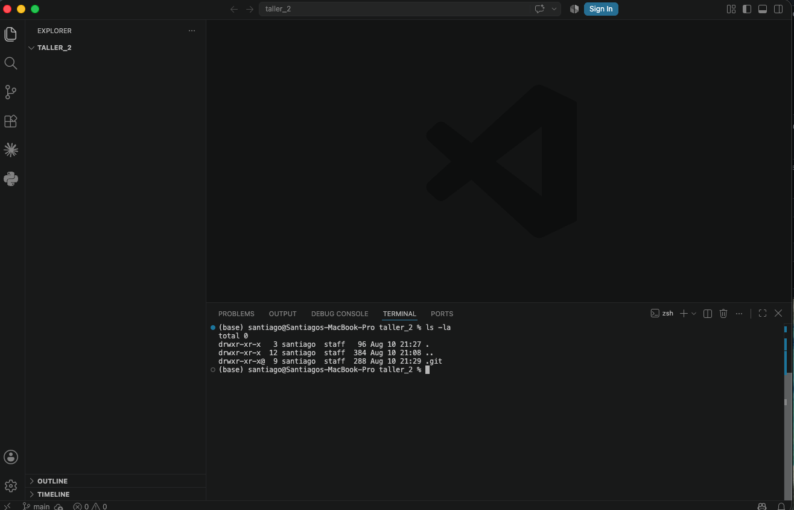
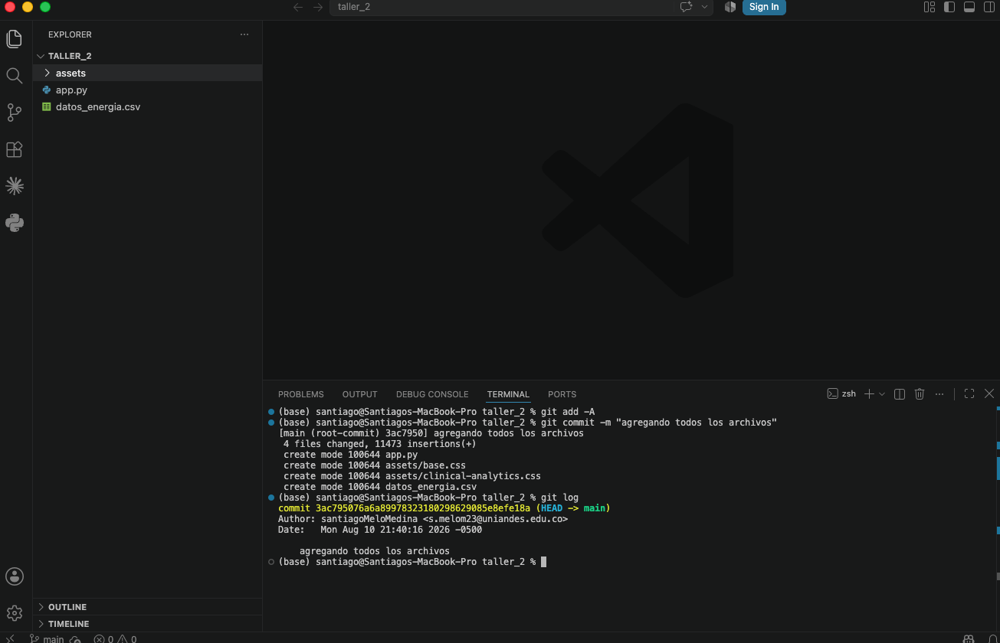
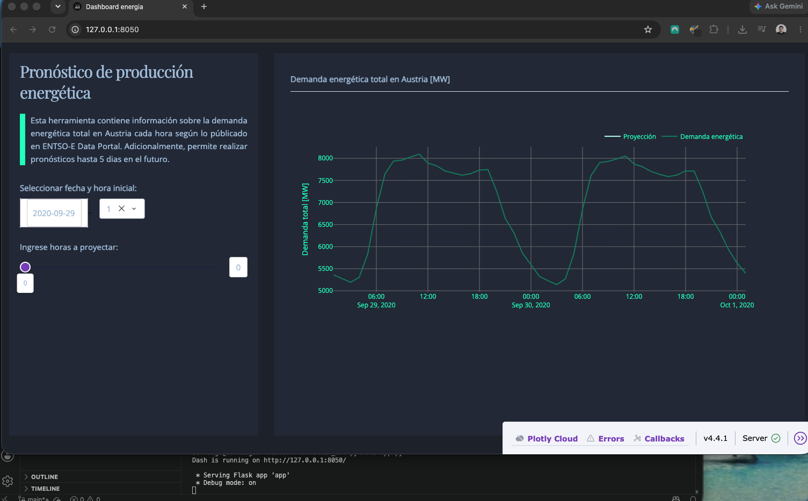
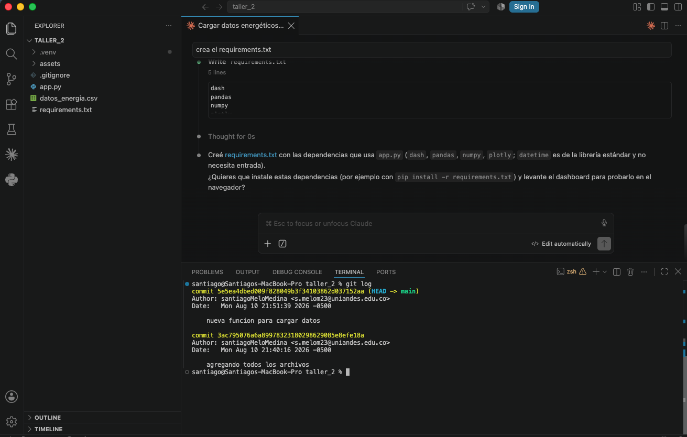
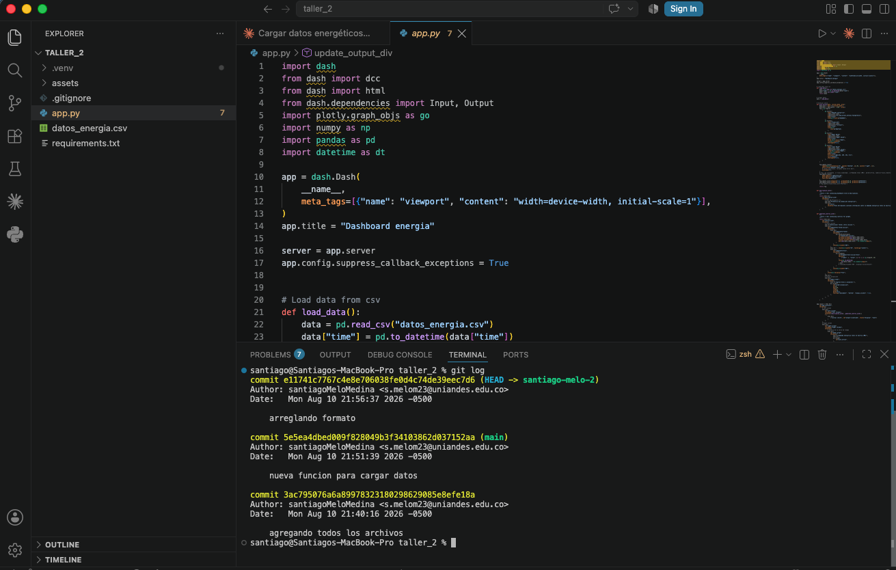
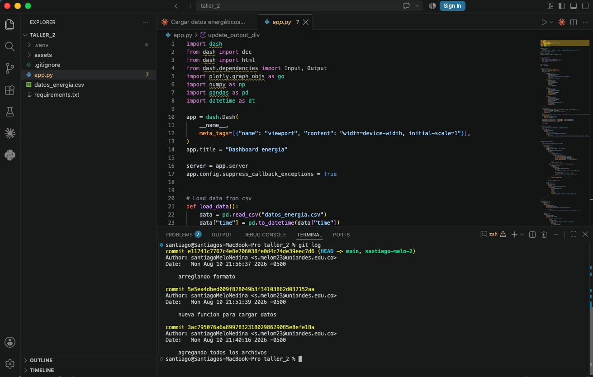
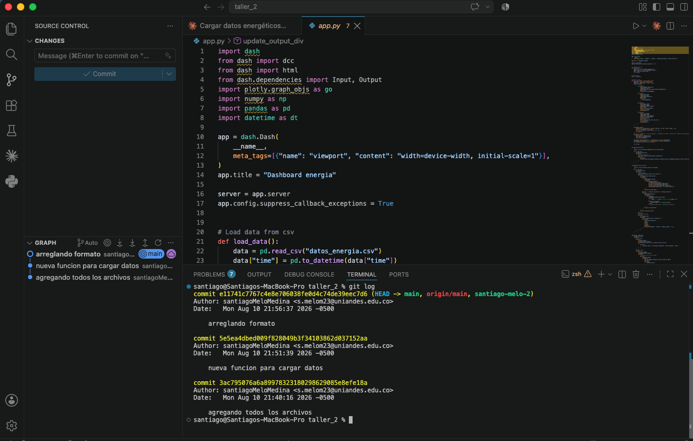
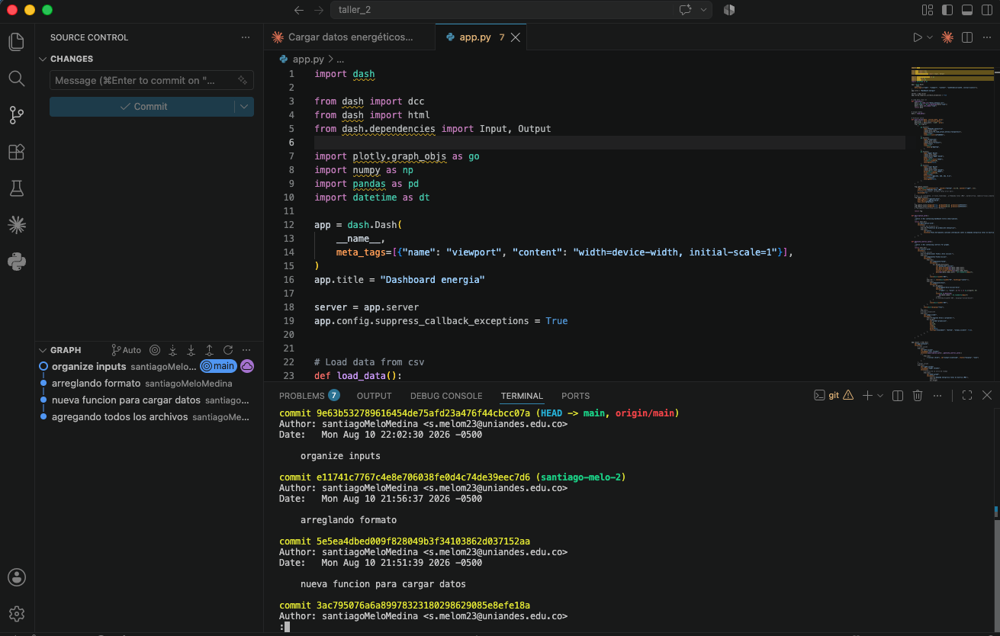

# Taller 2: Repositorios en GitHub

**Nombre: Santiago Melo Medina**

**Fecha: 10/Agosto/2026**

---

## 1. Crear un repositorio Git local

### 1.4 Carpeta `.git`

### 1.8 `git log`

### 1.10 Tablero funcionando

### 1.13 Historial de commits

---

## 2. Trabajar distintas ramas

### 2.4 Rama personal con cambios

### 2.8 Merge a `main`

---

## 3. Publicar un repositorio en GitHub

### 3.3 Rama `main` asociada a repositorio remoto

### 3.6 Rama `main` remota actualizada

